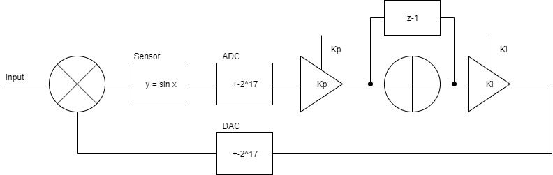

# python-vhdl-control-loop
Often it is necessary to place a control loop around a nonlinear sensor and realise the loop in *VHDL*. Simulating this can be difficult however co-simulation can help. 

Assume that the sensor gives the sin of the input and that it is possible to apply a feedback to cancel the input signal then the control loop would begin to have the form (for a PI loop):




Where *Kp* and *Ki* are the loop coefficients.

This can be simulated in Python using a simple script such as the [Floating point control loop](python/FloatingPointControlLoop.py) to yield a simple loop which has the coefficients:

* Kp = 1.5
* Ki = 0.8

This has the response:


It can follow an input as shown:


Python can be used to check the loop when using fixed point numbers. The output of the sensor is multiplied by the number of bits in the ADC and values following this rounded to integers. If the DAC in the system is not the same number of bits then the feedback will need to be scaled to ensure that the loop remains stable. 
In the example the decimal values of *Kp* and *Ki* have been implemented by multiplying by a value and then scaling back by bit shifting. 

The control loop can then be simulated from python using *coco-tb*.

```python
for i in range(1, len(timebase)):
        yield clkedge

        inputSignal.append(stimulus[i])
        controllerError.append(float(stimulus[i]) - float(feedback[i - 1]))
        # The plant is a sine wave
        plantOut.append(math.sin(controllerError[i]) * (2 ** 17))
        dut.controlInput_i.value = int(plantOut[i])
        Output.append(dut.feedback_o.value.signed_integer)
        feedback.append((dut.feedback_o.value.signed_integer) / (2 ** 17))
```

On each clock edge the previous feedback value (divided by the number of bits to represent the DAC) is applied to the input signal as an error correction. The sensor then takes the Sin of the remaining difference and scales it up by 2^17 representing an 18 bit DAC. This is then passed to the VHDL using the line:

```python
dut.controlInput_i.value = int(plantOut[i])
```

The control loop in the VHDL is used to generate the output and therefore tested. It can be compared against the floating point implementation if required. 

*Notes:*
* NumPy can be used for generating the signals however I could not get this to work using WSL but have previously had it working on a true Linux build.
